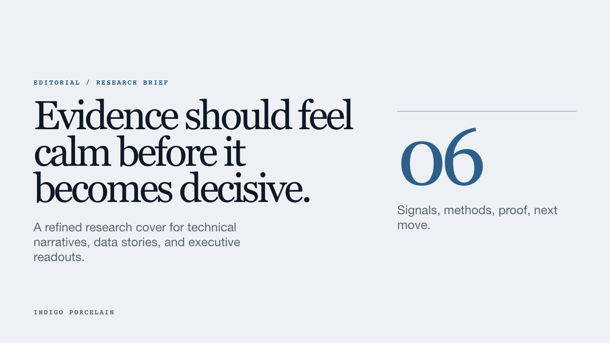
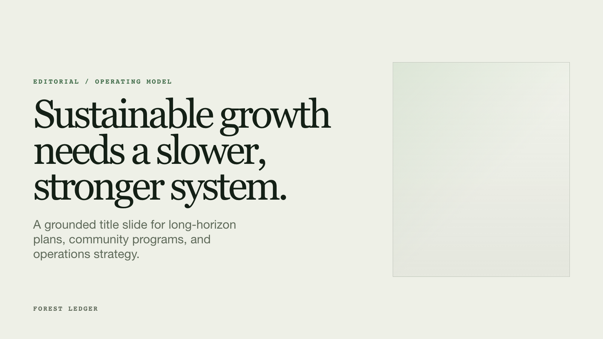

# HTML Presentation Deck

Create polished, browser-native presentation decks as standalone HTML files. Use it when a deck should open locally, be hosted as a web page, or present product screenshots with clean keyboard and swipe navigation.

## Install

```bash
npx @citedy/skills install html-deck
```

Install for one runtime only:

```bash
npx @citedy/skills install --target claude html-deck
npx @citedy/skills install --target codex html-deck
```

## Use

```text
/html-deck Build a 10-slide investor update for a B2B SaaS launch.
```

The skill creates a standalone `deck/index.html`, keeps images in `deck/images/`, and validates the final deck with `scripts/validate_html_deck.py`.

## Design Systems

Choose one visual system per deck.

- **Editorial** for founder updates, research stories, customer narratives, and strategy decks that need a memorable point of view.
- **Clean Grid** for board updates, operating reviews, product roadmaps, metrics, comparisons, and executive decision decks.

## Cover Examples

### Editorial






### Clean Grid


## What You Get

- Offline-friendly HTML output with no required runtime framework.
- Keyboard navigation, touch swipe navigation, slide progress, and an index overlay.
- Two constrained visual systems with reusable templates, layouts, and theme variables.
- Typography presets for system-safe, modern product, executive grid, editorial, and coverage-first decks.
- Screenshot framing guidance for product demos and evidence-heavy decks.
- A validator that catches unreplaced placeholders, missing local images, and banned source terms.

## Files

- `SKILL.md` defines when and how agents should use the skill.
- `assets/template-editorial.html` is the Editorial deck template.
- `assets/template-clean-grid.html` is the Clean Grid deck template.
- `references/` contains layout, theme, typography, image, and screenshot guidance.
- `scripts/validate_html_deck.py` validates generated decks before sharing.
