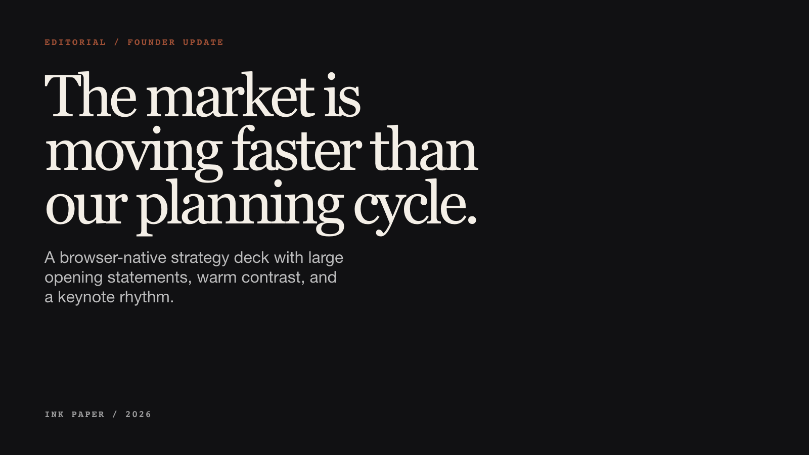
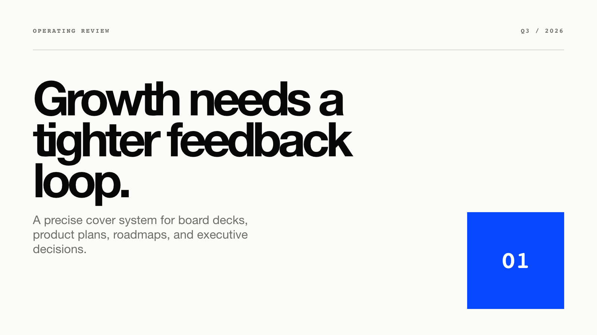
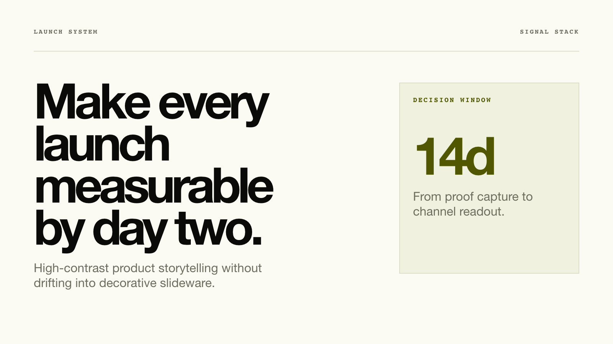
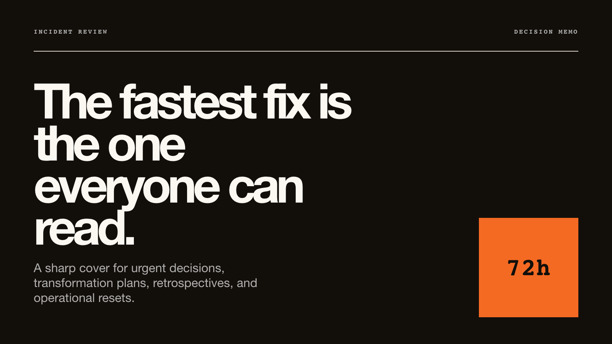

# HTML Presentation Deck

We just shipped `html-deck` for `@citedy/skills`.

Create polished, browser-native presentation decks from a prompt: editorial covers, clean grid systems, screenshot framing, keyboard navigation, and built-in HTML validation.

Give your coding agent a repo, docs folder, screenshots, or product brief, and it turns the context into a polished browser-native presentation deck.

## Install

```bash
npx @citedy/skills install html-deck
```

```text
/html-deck Build a 10-slide investor update for a B2B SaaS launch.
```

## Style Examples


| Editorial / Ink Paper | Editorial / Indigo Porcelain | Editorial / Forest Ledger |
| --- | --- | --- |
|  |  |  |

| Clean Grid / Blue Anchor | Clean Grid / Lemon Signal | Clean Grid / Orange Marker |
| --- | --- | --- |
|  |  |  |

## What It Includes

- Product Grid v2 for product launches, investor updates, and strategy decks.
- Editorial cover systems for founder updates, research stories, and narrative presentations.
- Clean Grid systems for board decks, roadmaps, metrics, and operating reviews.
- Screenshot framing rules for product UI, dashboards, and evidence slides.
- Built-in validators for deck structure, image slots, contrast, and common layout mistakes.
